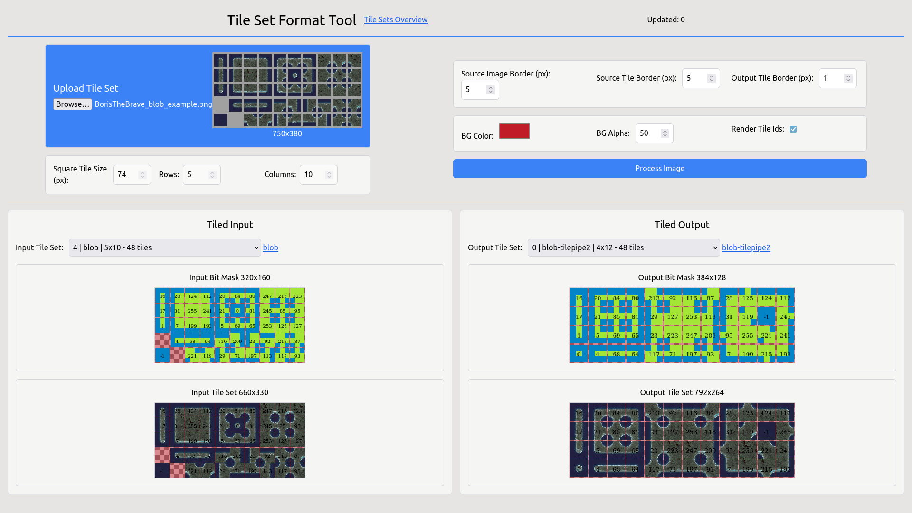
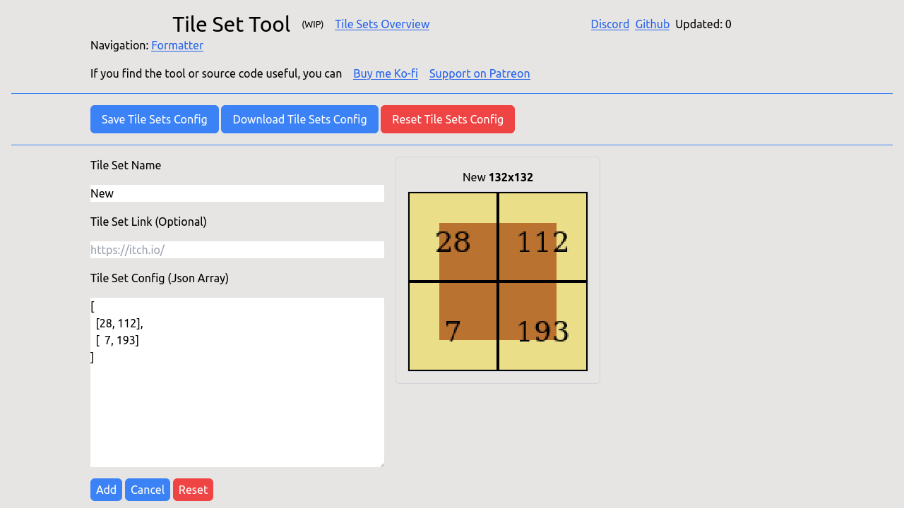

# Tile Set Format Tool [App](https://deniszholob.github.io/tileset-format-tool/)

Tile set tool to convert wetween different tile set formats, and modify borders.

## Deployments 

- Master branch is for the source code that's hosted on
  [GhPages](https://deniszholob.github.io/tileset-format-tool/)

# Support Me

If you find the cheat sheet or the source code useful, consider:

- Donating Ko-fi: https://ko-fi.com/deniszholob
- Supporting on Patreon: https://www.patreon.com/deniszholob

# Screenshots

