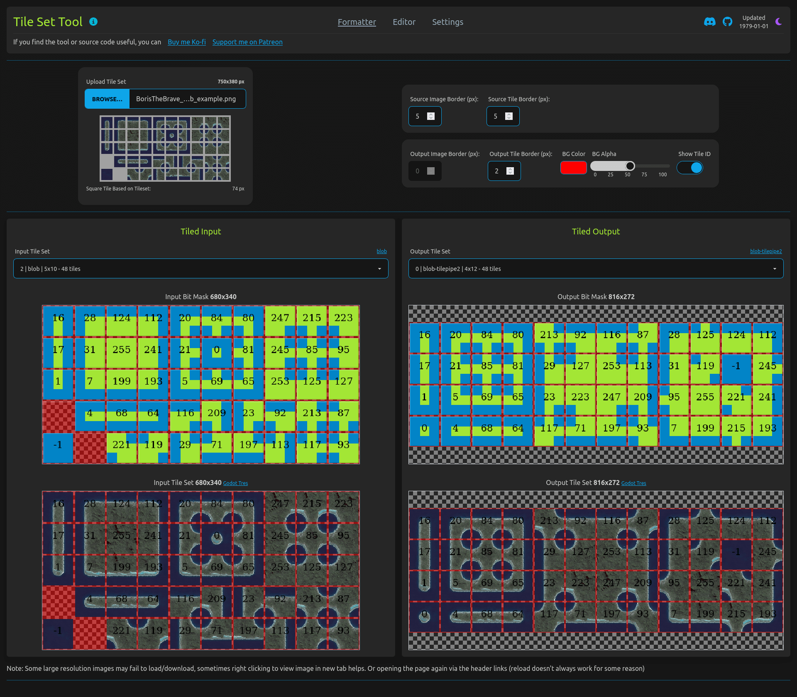
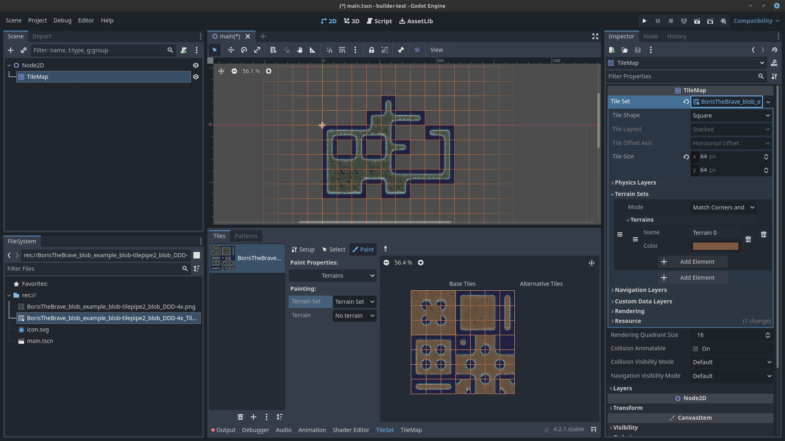

# Tile Set Format Tool [App](https://deniszholob.github.io/tileset-format-tool/)

Tile set tool to convert wetween different tile set formats, and modify borders.

## Deployments 

- Master branch is for the source code that's hosted on
  [GhPages](https://deniszholob.github.io/tileset-format-tool/)

# Support Me

If you find the cheat sheet or the source code useful, consider:

- Donating Ko-fi: https://ko-fi.com/deniszholob
- Supporting on Patreon: https://www.patreon.com/deniszholob

# Screenshots

### Formatter Page

### Editor Page

### Settings Page

### Godot .tres export:

1. Download the tilemap image and corresponding godot tres
2. Load image and. tres into godot root folder (drag-n-drop)
3. Load the .tres into a TileMap's node "Tile Set" input

Texture, tile size, and tile terrain bitmask is all set in the .tres, all you have to do is paint!

